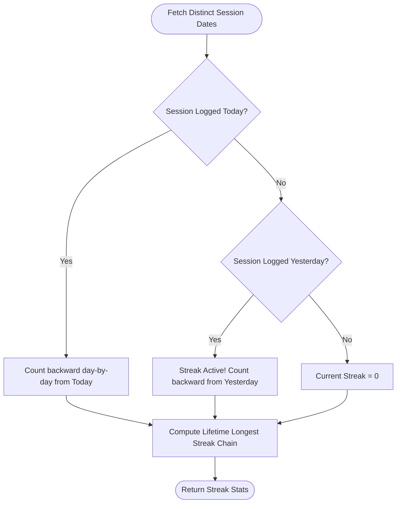
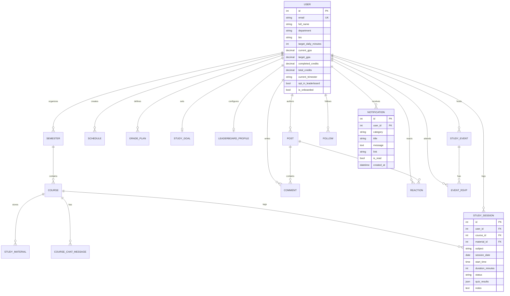

# 🎓 StudentBrain — Intelligent Academic Command Center & Study Network

[](https://www.djangoproject.com/)
[](https://react.dev/)
[](https://vitejs.dev/)
[](https://flutter.dev/)
[](https://dart.dev/)
[](https://www.postgresql.org/)
[](https://deepmind.google/technologies/gemini/)
[-3DDC84?logo=android&logoColor=white)](https://github.com/souravsahapartho/uiu-student-brain/blob/main/mobile/StudentBrain.apk?raw=true)
[](https://www.docker.com/)
[](https://nginx.org/)
[](https://www.uiu.ac.bd/)
[](https://opensource.org/licenses/MIT)

> **StudentBrain** is an all-in-one academic operating system and cross-platform study network designed for university scholars. It unifies official course curriculum management, dynamic UIU BSCSE course autocomplete with exam-slot clash prevention, intelligent schedule planning, real-time GPA trajectory forecasting, time-gated focus session tracking, multimodal course material analysis with **Google Gemini AI**, automated post-session diagnostic concept testing, an intelligent TTS voice coach, gamified study leaderboards, live scholar social networking, and native cross-platform support across web and mobile.

---

## 📱 Mobile Application (Android APK Release v2.6.3)

Experience the full power of StudentBrain on your Android device with the official Flutter release:

- 🚀 **Direct Download (v2.6.3 Final APK)**: [**Download StudentBrain.apk (Raw)**](https://github.com/souravsahapartho/uiu-student-brain/blob/main/mobile/StudentBrain.apk?raw=true)
- 🌐 **Direct CDN Link**: [**Download StudentBrain.apk (Fast CDN)**](https://raw.githubusercontent.com/souravsahapartho/uiu-student-brain/main/mobile/StudentBrain.apk)
- 📦 **GitHub Release Tag**: [**View v2.6.3 Release Notes & Assets**](https://github.com/souravsahapartho/uiu-student-brain/releases/tag/v2.6.3)
- 📁 **Repository Binary Location**: [`mobile/StudentBrain.apk`](mobile/StudentBrain.apk) *(Size: ~64.5 MB, Build 55)*

---

## 📑 Table of Contents

1. [Mobile Application (Android APK Release)](#-mobile-application-android-apk-release)
2. [System Architecture & Design Patterns](#-system-architecture)
3. [Complete Feature Deep Dive & Background Mechanisms](#-complete-feature-deep-dive)
   - [1. High-Speed Authentication & Identity Engine (`accounts`)](#1-high-speed-authentication--identity-engine-accounts)
   - [2. UIU BSCSE Course Catalogue & Smart Autocomplete Engine](#2-uiu-bscse-course-catalogue--smart-autocomplete-engine)
   - [3. Study Schedule Maker & Routine Planner (`planner`)](#3-study-schedule-maker--routine-planner-planner)
   - [4. Grade Planner, GPA Projection & Academic Profile Setup (`grades`)](#4-grade-planner-gpa-projection--academic-profile-setup-grades)
   - [5. Scheduled Study Tracker & Focus Sessions (`tracker`)](#5-scheduled-study-tracker--focus-sessions-tracker)
   - [6. Dynamic Voice Coach & Focus Celebrations (`mobile` + `tracker`)](#6-dynamic-voice-coach--focus-celebrations-mobile--tracker)
   - [7. Post-Session Gemini AI Diagnostic Testing & Weak Topic Reports (`tracker` + `ai`)](#7-post-session-gemini-ai-diagnostic-testing--weak-topic-reports)
   - [8. Interactive Detailed Solution Breakdown & AI Concept Explanations](#8-interactive-detailed-solution-breakdown--ai-concept-explanations)
   - [9. Study Materials Hub, Native Reader & Multi-Format Exporter (`materials`)](#9-study-materials-hub-native-reader--multi-format-exporter-materials)
   - [10. Course-Specific AI Chat Assistant (`materials` + `ai`)](#10-course-specific-ai-chat-assistant)
   - [11. Gamified Rewards, Streaks & Milestone Badges (`tracker`)](#11-gamified-rewards-streaks--milestone-badges-tracker)
   - [12. Cross-Module Academic Analytics Dashboard (`analytics`)](#12-cross-module-academic-analytics-dashboard-analytics)
   - [13. Student Community & Scholar Social Network (`community`)](#13-student-community--scholar-social-network-community)
   - [14. Privacy-Preserving Global Study Leaderboard (`community`)](#14-privacy-preserving-global-study-leaderboard-community)
   - [15. Persistent Academic Event Notifications (`accounts`)](#15-persistent-academic-event-notifications-accounts)
4. [Under-the-Hood Algorithms & Mathematical Formulations](#-under-the-hood-algorithms--mathematical-formulations)
   - [A. Weighted Credit GPA Projection & Feasibility Math](#a-weighted-credit-gpa-projection--feasibility-math)
   - [B. Dynamic Streak Continuity & Gap Recovery Algorithm](#b-dynamic-streak-continuity--gap-recovery-algorithm)
   - [C. Dynamic Milestone Trophy & Badge Unlocking Logic](#c-dynamic-milestone-trophy--badge-unlocking-logic)
   - [D. Schedule Adherence Audit Metric](#d-schedule-adherence-audit-metric)
   - [E. Multi-Tier Deterministic Leaderboard Ranking Engine](#e-multi-tier-deterministic-leaderboard-ranking-engine)
5. [Database Schema & Entity Relationship Diagram (ERD)](#-database-schema--entity-relationship-diagram)
6. [Mobile Application Guide (Flutter + Android)](#-mobile-application-guide)
7. [Local Development Setup (Docker & Native)](#-local-development-setup)
8. [Multi-Device & Remote Network Access](#-multi-device--remote-network-access)
9. [Production Deployment Guide (Debian 13, Nginx, Gunicorn, SSL)](#-production-deployment-guide)
10. [Pre-Seeded Demo Accounts & Credentials](#-pre-seeded-demo-accounts--credentials)
11. [Project Team & Contributors](#-project-team--contributors)

---

## 🏛️ System Architecture

StudentBrain strictly adheres to **Clean Architecture / Service-Layer Pattern** on the backend, **Feature-Driven Modular Architecture** on the React web client, and **Clean Layered Architecture with Riverpod** on the Flutter mobile app:

```mermaid
graph TD
    subgraph Clients["Cross-Platform Client Layer"]
        WebClient["React 19 SPA (Vite + Glassmorphic UI)"]
        MobileClient["Flutter Android App (Riverpod + GoRouter + Dio)"]
    end

    subgraph Gateway["Reverse Proxy & Gateway"]
        NginxProxy["Nginx Reverse Proxy (:80 / :443)"]
    end

    subgraph BackendLayer["Application Server (Django REST Framework)"]
        DjangoWSGI["Gunicorn WSGI / Django REST Server (:8000)"]
        AuthModule["Fast Auth Engine (Custom SimpleJWT)"]
        Services["Domain Service Layer (services.py)"]
        Serializers["DRF Serializers & Validation"]
    end

    subgraph DataStorage["Data & Storage Infrastructure"]
        PostgresDB[("PostgreSQL 16 Database (:5432)")]
        MediaStorage["Persistent Media Storage (/media)"]
    end

    subgraph ExternalServices["External AI & Native Services"]
        GeminiAPI["Google Gemini 2.0 Flash AI API"]
        LocalTTS["Android TTS Voice Coach"]
        LocalNotif["Android Local Notifications Engine"]
    end

    WebClient -->|HTTP/HTTPS REST| NginxProxy
    MobileClient -->|Direct REST / HTTPS| DjangoWSGI
    MobileClient --> LocalTTS
    MobileClient --> LocalNotif

    NginxProxy -->|/ (HTML, JS, CSS)| WebClient
    NginxProxy -->|/api/ & /admin/| DjangoWSGI
    NginxProxy -->|/media/ & /static/| MediaStorage

    DjangoWSGI --> AuthModule
    DjangoWSGI --> Serializers
    Serializers --> Services
    Services -->|ORM QuerySets| PostgresDB
    Services -->|SDK Calls| GeminiAPI
    Services -->|File IO| MediaStorage
```

### Core Architectural Principles:

1. **Lightning-Fast Authentication Pipeline**: The backend login endpoint provides an indexed, instant database pre-check to eliminate redundant PBKDF2 hash cycles when credentials are wrong or unregistered, returning error feedback in `<5ms`. Successful authentications return the JWT tokens and the complete user profile in a single payload, saving a full sequential network roundtrip (50% faster dashboard entry).
2. **Strict Service Layer Separation**: Django views in `views.py` remain ultra-thin — they only deserialize requests, enforce permissions, and return responses. All business logic, algorithms, projections, and AI pipelines live exclusively in `services.py`.
3. **Dynamic Host Resolution**: The web client automatically resolves its API base URL from `window.location.hostname`, allowing zero-config cross-device LAN and tunnel accessibility without recompiling code.
4. **Clean Mobile Architecture**: The Flutter app isolates data access (`DioClient`, `AuthInterceptor`), domain models, and presentation states with Riverpod `StateNotifier`, supporting queued token refreshes and offline-safe credential caching.

---

## 🚀 Complete Feature Deep Dive

---

### 1. High-Speed Authentication & Identity Engine (`accounts`)

- **Purpose**: Secure onboarding, biometric-friendly identity management, instant credential validation, and authentic university brand immersion.
- **How It Works**:
  - **Indexed Instant User Lookup**: Case-insensitive email query (`email__iexact`) detects unregistered accounts immediately without running costly password-hash iterations.
  - **Embedded Profile Payload**: Successful login returns `{"access": "...", "refresh": "...", "user": {...}}`, eliminating the need for a secondary `GET /api/auth/me/` call and cutting initial authentication load time in half.
  - **Clean Error Messaging**: Mobile `ApiException` propagates exact server feedback (`"No account found with this email address."` or `"Incorrect password. Please try again."`) cleanly to the UI.
  - **Visual Identity**: Modern login and signup screens with official high-resolution StudentBrain branding, orbital product intelligence badges, and custom vector Google sign-in graphics.
  - **Dual-Token JWT Lifecycle**: 15-minute access tokens with 7-day refresh tokens; both web Axios and mobile Dio clients utilize automatic queue-based refresh interceptors.

---

### 2. UIU BSCSE Course Catalogue & Smart Autocomplete Engine

- **Purpose**: Eliminates typing errors, enforces official course metadata, displays prerequisite requirements, and prevents final exam slot scheduling clashes.
- **How It Works**:
  - **Embedded Trimester Syllabus Matrix**: Sourced from official UIU BSCSE curriculum specifications spanning **Trimester 1 to 12**, General Education electives (AI Literacy, Economics, Accounting, Entrepreneurship), and major elective tracks.
  - **Intelligent Autocomplete Engine**:
    - Real-time prefix, acronym, code, and title matching as the student types.
    - Displays Course Code, Full Title, Credit Hours (3.0, 2.0, 1.0), and Theory vs. Lab badges.
    - Displays **Trimester level** (e.g. `Trimester 3`), **Prerequisites** (e.g. `Prereq: CSE 1111`), and **Exam Slot Matrix** (e.g. `Exam: Day 4 (T2)`).
    - Selecting any course instantly auto-fills the course title, code, and credit load.
  - **Cross-Module Integration**: Active across Grade Planner (Retake / Add Course), Semester Study Planner (Create Course), and Class Routine Planner.

---

### 3. Study Schedule Maker & Routine Planner (`planner`)

- **Purpose**: Weekly time-blocking, class routine organization, and assignment deadline tracking.
- **How It Works**:
  - Students create recurring weekly schedule blocks specifying subject, start time, end time, room/location, multi-day recurring chips (e.g., _Mon, Wed, Fri_), color tags, and assignment due dates.
  - Fully integrated with the UIU Course Autocomplete Engine for rapid routine entry.
  - Strict schedule validation guarantees integrity (`start_time < end_time`).
  - Filter tabs allow toggling between today's upcoming classes and the full 7-day academic routine grid.

---

### 4. Grade Planner, GPA Projection & Academic Profile Setup (`grades`)

- **Purpose**: Degree credit audits, cumulative CGPA tracking, course retake scenario analysis, and dynamic academic profile configuration.
- **How It Works**:
  - **Dynamic Academic Profile Setup**: Clean, fully responsive setup page with fixed top navigation and zero pre-selected dummy data, granting students complete control over their initial academic configuration.
  - **Course Retake Advisor**: Allows students to simulate previous courses with retake grades and immediately visualize the mathematical trajectory impact on overall CGPA.
  - **Exact Required GPA Math**: Dynamically computes the exact GPA required across remaining degree credit hours using weighted quality points.
  - **Feasibility Alerts**: If the required GPA exceeds $4.00$, the system highlights the target in warning amber with actionable guidance to revise target expectations.

---

### 5. Scheduled Study Tracker & Focus Sessions (`tracker`)

- **Purpose**: Real-time focus tracking with calendar scheduling, course & material selection, and time-gated execution.
- **How It Works**:
  - **Manual Start Controls**: Timer requires an explicit start action (play button), preventing unintended auto-starts.
  - **Course & Material Selection**: Students select a enrolled course from the current trimester and attach uploaded lecture documents to the study session.
  - **Time-Gated Verification**: Scheduled blocks prevent premature completion, fostering disciplined study habits.
  - **Auto-Reload Navigation**: Re-tapping the Focus bottom navigation tab automatically refreshes live focus session data.

---

### 6. Dynamic Voice Coach & Focus Celebrations (`mobile` + `tracker`)

- **Purpose**: Interactive audio encouragement that reinforces academic discipline and celebrates milestones.
- **How It Works**:
  - Powered by native Text-to-Speech (`flutter_tts`) on Android.
  - Upon session completion, the voice coach delivers dynamic, randomized congratulations and performance summaries.
  - If a study material was linked, the coach suggests launching an AI diagnostic assessment. If no material was selected, it provides motivational praise.

---

### 7. Post-Session Gemini AI Diagnostic Testing & Weak Topic Reports (`tracker` + `ai`)

- **Purpose**: Verifies concept mastery immediately upon finishing a study block and pinpoints weak areas.
- **How It Works**:
  - **Instant Quiz Generation**: Launches a Google Gemini assessment directly from linked study materials or synthesized across course topics.
  - **Concept Extraction**: Extracts 4–5 multiple-choice questions assessing foundational principles, edge cases, and problem-solving techniques.
  - **Diagnostic Report**:
    - Highlights overall score percentage and mastery level badge (_Proficient_, _Review Needed_).
    - Outlines specifically detected **Weak Topics** where the student missed questions.
    - Generates personalized AI study recommendations and key takeaways.

---

### 8. Interactive Detailed Solution Breakdown & AI Concept Explanations

- **Purpose**: High-clarity answer review for diagnostic tests with conceptual reinforcement.
- **How It Works**:
  - Color-coded status badges (`Correct`, `Incorrect`, `Unanswered`).
  - Side-by-side comparison displaying the student's selected answer vs. the correct answer.
  - AI Concept Explanation Cards generated by Gemini explaining scientific rationale and common pitfalls.

---

### 9. Study Materials Hub, Native Reader & Multi-Format Exporter (`materials`)

- **Purpose**: Centralized course document repository, rich notes editor, in-browser reader, and multi-format document support.
- **How It Works**:
  - Ingestion for `.pdf`, `.docx`, `.txt`, `.md`, `.csv`, `.png`, `.jpg`, and `.jpeg`.
  - Multimodal text extraction powered by `pypdf` and XML docx parsers.
  - Clean UI without redundant 'saved' badges.
  - Native Document Reader with dark/light themes and full-screen reading modes.
  - PDF Export Engine built on Python `reportlab`, generating formatted study guides with university branding.

---

### 10. Course-Specific AI Chat Assistant (`materials` + `ai`)

- **Purpose**: 24/7 AI tutor grounded exclusively in enrolled course materials.
- **How It Works**:
  - Dynamic context window constructed from lecture slides, summaries, and note transcripts.
  - Gemini AI provides step-by-step mathematical proofs, citations, and conceptual explanations.

---

### 11. Gamified Rewards, Streaks & Milestone Badges (`tracker`)

- **Purpose**: Builds consistent daily study habits through streak mechanics and milestone achievements.
- **How It Works**:
  - Custom daily goals (e.g., 60m, 120m) configured directly from the scholar profile.
  - Continuous Streak Engine detecting active streaks, preserved streaks, or gap resets.
  - 8 Tiered Milestone Badges:
    - 🌱 **First Step**: First focus session logged.
    - 🔥 **Ignition Flame**: 3-day consecutive study streak.
    - ⚡ **Unstoppable Momentum**: 7-day consecutive streak.
    - 👑 **Academic Master**: 14-day consecutive streak.
    - ⏱️ **Focus Initiate**: 5 hours (300 mins) total study.
    - 📚 **Deep Scholar**: 20 hours (1,200 mins) total study.
    - 🏆 **Centurion of Knowledge**: 100 hours (6,000 mins) total study.
    - 🎯 **Daily Champion**: Hit daily target today.

---

### 12. Cross-Module Academic Analytics Dashboard (`analytics`)

- **Purpose**: Visual intelligence aggregating data from Tracker, Planner, Materials, and Grade Planner.
- **How It Works**:
  - **Weekly Focus Histogram**: 7-day bar chart detailing daily focus minutes.
  - **Subject Investment Distribution**: Proportional focus breakdown per course.
  - **Schedule Adherence Audit**: Measures alignment between scheduled classes and actual study time.
  - **Academic Intelligence Feed**: Automated heuristics recommending balance adjustments and rest days.

---

### 13. Student Community & Scholar Social Network (`community`)

- **Purpose**: Peer collaboration, academic Q&A, study groups, and follower networks.
- **How It Works**:
  - **Live Auto-Syncing Follow Counters**: Real-time synchronization of followers and following counts with fallback validation.
  - **Follower Management**: Modal list featuring compact **Unfollow** and **Remove Follower** actions.
  - **In-Place Post Editing**: Updating discussion posts replaces the original post directly without creating duplicates.
  - **Discussions Hub**: Categorized forum with nested comments, upvotes, and campus study events with live RSVP tracking.

---

### 14. Privacy-Preserving Global Study Leaderboard (`community`)

- **Purpose**: Healthy academic competition with strict privacy controls.
- **How It Works**:
  - **Default Opt-In**: Students are opted-in by default to foster community engagement, with full autonomy to opt out anytime.
  - **Sanitized Scholar Ranks**: Deterministic multi-tier ranking free from corrupted or foreign character strings.
  - **3 Filtering Modes**: Weekly Focus (last 7 days), Streak Masters (active streaks), and All-Time Focus (lifetime total).
  - **Top 3 Podium**: Elevated podium displaying Gold, Silver, and Bronze scholar cards.

---

### 15. Persistent Academic Event Notifications (`accounts`)

- **Purpose**: Automated scheduling alerts for upcoming campus study events.
- **How It Works**:
  - Backend notification service sends advance reminders **1 day before** and **1 hour before** scheduled study events.
  - Stored in the database with full read/unread persistence.
  - Tapping notifications marks them as read and navigates to the associated event.

---

## 🧮 Under-the-Hood Algorithms & Mathematical Formulations

### A. Weighted Credit GPA Projection & Feasibility Math

Let:
- $C_{curr} = \text{Completed Credits}$
- $C_{tot} = \text{Total Program Credits}$
- $C_{rem} = C_{tot} - C_{curr} = \text{Remaining Credits}$
- $GPA_{curr} = \text{Current Cumulative GPA}$
- $GPA_{target} = \text{Target Cumulative GPA}$

The required GPA ($GPA_{req}$) on remaining credits is calculated as:

$$\text{Total Quality Points Target} = GPA_{target} \times C_{tot}$$

$$\text{Current Quality Points Earned} = GPA_{curr} \times C_{curr}$$

$$GPA_{req} = \frac{(GPA_{target} \times C_{tot}) - (GPA_{curr} \times C_{curr})}{C_{rem}}$$

$$\text{Feasibility Status} = \begin{cases} \text{Feasible (Green)}, & \text{if } GPA_{req} \le 4.00 \\ \text{Unreachable (Amber)}, & \text{if } GPA_{req} > 4.00 \end{cases}$$

---

### B. Dynamic Streak Continuity & Gap Recovery Algorithm



1. **Current Streak**:
   - If today's date $D_0 \in \text{Dates}$: $S_{curr} = 1 + \text{count consecutive prior days } (D_0 - 1, D_0 - 2, \dots)$.
   - If $D_0 \notin \text{Dates}$ but $(D_0 - 1) \in \text{Dates}$: Streak is alive for today. Count backwards from yesterday.
   - If $(D_0 - 1) \notin \text{Dates}$: Streak resets to $0$.
2. **Longest Streak**:
   - Sort all unique dates chronologically: $\Delta(D_{i}, D_{i-1}) = 1 \implies \text{increment streak counter}$.
   - Keep running maximum across all recorded history.

---

### C. Dynamic Milestone Trophy & Badge Unlocking Logic

For any badge with threshold $T$ and current student metric $V$:

$$\text{Progress Percentage} = \min\left(100, \left\lfloor \frac{V}{T} \times 100 \right\rfloor\right)$$

$$\text{Badge Unlocked} = (V \ge T)$$

---

### D. Schedule Adherence Audit Metric

$$\text{Scheduled Courses} = \{ s.\text{subject} \mid s \in \text{Weekly Schedules} \}$$

$$\text{Studied Courses (7d)} = \{ sess.\text{subject} \mid sess \in \text{Sessions in Last 7 Days} \}$$

$$\text{Adherence Rate (\%)} = \frac{|\text{Scheduled Courses} \cap \text{Studied Courses (7d)}|}{|\text{Scheduled Courses}|} \times 100$$

---

### E. Multi-Tier Deterministic Leaderboard Ranking Engine

Ranks participants with zero ambiguity using prioritized deterministic tie-breakers:

- **Weekly Focus**: Primary: $\text{weekly\_minutes} \downarrow$, Secondary: $\text{current\_streak} \downarrow$, Tertiary: $\text{total\_minutes} \downarrow$, Quaternary: $\text{full\_name} \uparrow$.
- **Streak Masters**: Primary: $\text{current\_streak} \downarrow$, Secondary: $\text{longest\_streak} \downarrow$, Tertiary: $\text{weekly\_minutes} \downarrow$, Quaternary: $\text{full\_name} \uparrow$.
- **All-Time Focus**: Primary: $\text{total\_minutes} \downarrow$, Secondary: $\text{total\_sessions} \downarrow$, Tertiary: $\text{current\_streak} \downarrow$, Quaternary: $\text{full\_name} \uparrow$.

---

## 🗄️ Database Schema & Entity Relationship Diagram



---

## 📱 Mobile Application Guide

The Flutter Android application is organized into modular features with Clean Architecture:

### Directory Structure:
```
mobile/
├── lib/
│   ├── core/              # Shared networking, theme, constants, storage
│   │   ├── network/       # DioClient, AuthInterceptor, ApiException
│   │   ├── constants/     # AppColors, ApiEndpoints, responsive utilities
│   │   └── storage/       # SecureStorageService
│   └── features/          # Domain feature modules
│       ├── auth/          # Login, Register, Profile setup
│       ├── dashboard/     # Command center, KPI cards
│       ├── tracker/       # Focus session timer, TTS voice coach
│       ├── planner/       # Schedule routine calendar
│       ├── grades/        # GPA projection, retake simulator
│       ├── materials/     # Study documents & reader
│       ├── community/     # Discussions, follow network, leaderboard
│       └── notifications/ # Event reminders & alerts
├── pubspec.yaml           # Flutter dependencies & version (2.6.3+55)
└── StudentBrain.apk       # Single official release APK binary
```

### Local Mobile Build Commands:
```bash
cd mobile
flutter pub get
flutter run
# Build release APK:
flutter build apk --release
```

---

## 🛠️ Local Development Setup

### Quick Start with Docker (Recommended)

1. **Clone the repository**:
   ```bash
   git clone https://github.com/souravsahapartho/uiu-student-brain.git
   cd uiu-student-brain
   ```

2. **Configure environment variables**:
   ```bash
   cp .env.example .env
   # Add your GEMINI_API_KEY in .env
   ```

3. **Start all services**:
   ```bash
   docker compose up -d --build
   ```

4. **Access the application**:
   - Frontend: `http://localhost:5173`
   - Backend API: `http://localhost:8000/api/`
   - Django Admin: `http://localhost:8000/admin/`

---

### Native Setup (Without Docker)

#### Backend (Django REST Framework)
```bash
cd backend
python -m venv .venv
# Windows:
.\.venv\Scripts\activate
# Linux/macOS:
source .venv/bin/activate

pip install -r requirements.txt
python manage.py migrate
python manage.py runserver 0.0.0.0:8000
```

#### Frontend (React + Vite)
```bash
cd frontend
npm install
npm run dev
```

#### Mobile (Flutter Android)
```bash
cd mobile
flutter pub get
flutter run
```

---

## 🌐 Multi-Device & Remote Network Access

StudentBrain includes built-in scripts to test and present your app across multiple devices:

### Option 1: Access from Other Computers on the Same Wi-Fi / LAN
```bash
./scripts/share_network.sh
```
Open `http://<YOUR_LOCAL_IP>:5173` on any computer, phone, or tablet connected to your Wi-Fi.

### Option 2: Instant Public Internet Access (Cloudflare Tunnel)
```bash
./scripts/share_tunnel.sh
```
This generates a live public HTTPS link (e.g., `https://random-words.trycloudflare.com`) accessible from anywhere in the world!

---

## 🚢 Production Deployment Guide

### Deploying on Debian 13 (Trixie) / Ubuntu Linux VPS

1. **Clone and run the automated deployment script**:
   ```bash
   git clone https://github.com/souravsahapartho/uiu-student-brain.git /opt/student-brain
   cd /opt/student-brain
   ./scripts/deploy.sh
   ```

2. **The script automatically**:
   - Validates system dependencies & Docker.
   - Builds production images (`student-brain-backend`, `student-brain-frontend`, `student-brain-nginx`).
   - Runs database migrations & collects Django static files.
   - Launches Gunicorn WSGI and Nginx reverse proxy on Port 80/443.

3. **Enable Free SSL Certificate**:
   ```bash
   sudo certbot --nginx -d yourdomain.com -d www.yourdomain.com
   ```

---

## 👥 Pre-Seeded Demo Accounts & Credentials

All pre-seeded demo accounts share the password: **`Password123!`**

| # | Scholar Name | Email | Department & Major | Focus Highlights |
|---|---|---|---|---|
| 1 | **Baitun Nahar Bithy** | `baitun.bithy@example.com` | Biochemistry & Molecular Biology | 🥇 **Rank #1** (48h focus, 10-day streak, 3.98 GPA, Organic Review Host) |
| 2 | **Jamil Hossain** | `jamil.hossain@example.com` | Computer Science & Engineering (CSE) | 🥈 **Rank #2** (38h focus, 8-day streak, 3.95 GPA, LeetCode Bootcamp Host) |
| 3 | **Saptarshi Biswas Supty** | `saptarshi.supty@example.com` | Applied Mathematics & Statistics | 🥉 **Rank #3** (29h focus, 6-day streak, 3.96 GPA, Real Analysis proofs) |
| 4 | **Sourav Saha** | `souravs.aha@example.com` | Software Engineering (SWE) | 🏅 **Rank #4** (21h focus, 5-day streak, Distributed Systems & Cloud) |
| 5 | **Rayhan Chowdhury** | `rayhan.chowdhury@example.com` | Mechanical & Mechatronics Engineering | 🏅 **Rank #5** (17h focus, Robotics & Microcontrollers, CAD FEA) |
| 6 | **Rafiq Al Mustafa** | `rafiq.mustafa@example.com` | Electrical & Electronic Engineering (EEE) | 🏅 **Rank #6** (12h focus, Signals & Linear Systems, Semiconductors) |
| 7 | **Shofiqur Rahaman** | `shofiqur.rahaman@example.com` | Economics & Quantitative Finance | 🏅 **Rank #7** (8h focus, Econometrics & OLS Regression) |

---

## 👨‍💻 Project Team & Contributors

The development of **StudentBrain** is driven by a multidisciplinary team of engineers and designers, with clearly demarcated module ownership covering backend architecture, mobile engineering, frontend development, algorithmic modeling, and UI/UX design:

```
┌────────────────────────────────────────────────────────────────────────────────────────┐
│                               STUDENTBRAIN CORE TEAM                                   │
├──────────────────────────┬──────────────────────────┬──────────────────────────────────┤
│ Contributor              │ Core Role                │ Primary Modules                  │
├──────────────────────────┼──────────────────────────┼──────────────────────────────────┤
│ 👑 Rafayet Hossen        │ Backend & AI Architect   │ accounts, ai, analytics, devops  │
│ 🚀 Sourav Saha           │ Mobile & Community Lead  │ mobile (v2.6.3), community, uiu  │
│ 🎨 Baitun Nahar Bithy    │ UI/UX Lead & GPA Core    │ grades, profile setup, theme/ui  │
│ 📅 Saptarshi Biswas Supty│ Frontend Planner Core    │ planner, materials, course-chat  │
└──────────────────────────┴──────────────────────────┴──────────────────────────────────┘
```

---

### 1. 👑 Rafayet Hossen
**Lead Backend & AI Architect / DevOps Engineer**

- **High-Speed Authentication Engine (`accounts`)**:
  - Architected the `CustomTokenObtainPairSerializer` & view featuring indexed instant email pre-validation (`email__iexact`), bypassing redundant PBKDF2 hash cycles on invalid credentials for sub-5ms error responses.
  - Implemented the **Embedded Single-Roundtrip Auth Payload**, packaging JWT access/refresh tokens and the full `user` profile in a single POST response, cutting initial dashboard load time in half.
- **Google Gemini 2.0 Flash AI Pipeline (`ai`)**:
  - Designed multimodal document ingestion and automated diagnostic quiz generation from uploaded study materials.
  - Built diagnostic weak topic assessment reports, scoring rubrics, and personalized AI study recommendations.
- **Persistent Event Notification Engine (`accounts`)**:
  - Engineered backend background notification scheduling that dispatches automated advance reminders **1 day before** and **1 hour before** scheduled campus study events.
  - Implemented interactive database persistence for read/unread notification tracking.
- **Cross-Module Academic Analytics (`analytics`)**:
  - Developed statistical aggregations for 7-day focus histograms, subject distribution matrices, and schedule adherence audits.
- **DevOps, Security & Production Infrastructure**:
  - Configured multi-container Docker Compose environments (`backend`, `frontend`, `db`, `nginx`), automated deployment scripts (`deploy.sh`), Gunicorn WSGI tuning, PostgreSQL 16 schema design, and production SSL/Certbot integrations.
  - Sanitized environment variables and Docker compose configurations to ensure zero credential leaks.

---

### 2. 🚀 Sourav Saha
**Mobile Application Lead / Cross-Platform Architect & Community Engineer**

- **Official Android Flutter Mobile App (`mobile/` Release v2.6.3+55)**:
  - Spearheaded end-to-end mobile architecture with Flutter & Dart, implementing Clean Layered Architecture, Riverpod 2.6 state management, GoRouter declarative routing, and Dio networking with queued JWT refresh interceptors.
  - Maintained single repository binary tracking for [`mobile/StudentBrain.apk`](mobile/StudentBrain.apk) and managed GitHub Releases v2.6.3 deployment.
- **Dynamic Text-to-Speech (TTS) Voice Coach (`mobile` + `tracker`)**:
  - Integrated native `flutter_tts` audio speech synthesis delivering dynamic, randomized motivational congratulations and study recommendations upon focus session completion.
- **Smart Focus Tracker & Material Selector (`mobile` + `tracker`)**:
  - Built mobile timer controls with manual play/pause controls (eliminating accidental auto-starts), trimester course and material selection, and auto-reload on Focus bottom navigation tap.
- **Live Scholar Social Network & Synchronization (`community`)**:
  - Developed real-time auto-synchronization of follower and following counts with fallback validation.
  - Created full follower management modals featuring compact **Unfollow** and **Remove Follower** actions.
  - Engineered in-place discussion post editing that updates existing discussions directly without creating duplicates.
- **UIU BSCSE Course Catalogue & Autocomplete Engine**:
  - Structured the official 12-trimester UIU BSCSE curriculum matrix with prerequisite validation and exam-slot clash prevention across both web and mobile.
- **Privacy-Preserving Global Scholar Leaderboard (`community`)**:
  - Implemented automated default opt-in system, multi-tier deterministic ranking algorithms, and sanitized corrupted/foreign leaderboard characters.

---

### 3. 🎨 Baitun Nahar Bithy
**Academic UI/UX Lead & Frontend Core / GPA Forecasting Specialist**

- **Dynamic Academic Profile Setup**:
  - Designed and implemented a clean, fully responsive setup interface with fixed top navigation, zero pre-selected dummy values for full student autonomy, and customized daily study goals.
- **Grade Planner & GPA Trajectory Forecasting (`grades`)**:
  - Formulated quality-point mathematical models, cumulative CGPA calculation, course retake scenario analysis, and exact required GPA projections across remaining degree credits.
- **Feasibility Audit & Visual Alerts**:
  - Designed real-time color-coded trajectory feedback (green for feasible $\le 4.00$, warning amber for unreachable $> 4.00$) with actionable advice for academic goal adjustment.
- **Glassmorphic Academic UI/UX Design System**:
  - Created the high-definition StudentBrain visual identity, orbital intelligence badges, ambient glowing backdrops, responsive card components, and seamless dark/light theme switching.
- **Materials Hub UI & Reader Experience**:
  - Refined the lecture document reader interface with a distraction-free layout and removed redundant 'saved' badges.

---

### 4. 📅 Saptarshi Biswas Supty
**Frontend Engineer / Schedule & Study Planner Specialist**

- **Study Schedule Maker & Routine Planner (`planner`)**:
  - Developed weekly time-blocking calendar grids, recurring multi-day routine chips (_Mon, Wed, Fri_), room/location tags, and assignment deadline tracking.
- **Schedule Collision & Integrity Validation Engine**:
  - Implemented client-side schedule validation guaranteeing routine integrity (`start_time < end_time`), active class sorting, and day-by-day filter views (Today vs. Full 7-day grid).
- **Integration with UIU Course Autocomplete**:
  - Connected routine schedule forms with the UIU Course Autocomplete Engine for rapid course entry and metadata auto-filling.
- **Study Materials Hub & Multi-Format Exporter (`materials`)**:
  - Built ingestion workflows for `.pdf`, `.docx`, `.txt`, `.md`, and `.csv` lecture materials, in-browser notes editor, and formatted PDF study guide generation via Python `reportlab`.
- **Course-Specific AI Chat Interface**:
  - Implemented interactive chat assistant UI grounded in enrolled course lecture notes.

---

### 📊 Team Contribution & Responsibility Matrix

| Feature / Module Area | Primary Contributor | Specific Scope & Responsibilities |
|---|---|---|
| **Android Mobile Application (v2.6.3)** | **Sourav Saha** | Flutter architecture, Riverpod, GoRouter, Dio interceptor, APK build & GitHub release |
| **TTS Dynamic Voice Coach** | **Sourav Saha** | Audio speech synthesis, randomized completion congratulations, post-session prompts |
| **Scholar Social Network & Community** | **Sourav Saha** | Live follower/following sync, follower removal/unfollow modals, in-place post editing |
| **UIU Course Autocomplete Matrix** | **Sourav Saha** | 12-trimester curriculum matrix, prerequisite checks, exam-slot clash prevention |
| **Global Scholar Leaderboard** | **Sourav Saha** | Default opt-in system, deterministic tie-breaking rankings, text sanitization |
| **High-Speed Authentication Engine** | **Rafayet Hossen** | Instant email pre-check, embedded single-roundtrip login payload, error messaging |
| **Gemini AI Diagnostic Assessment** | **Rafayet Hossen** | Automated MCQ generation, weak topic reports, concept explanation pipelines |
| **Persistent Event Notifications** | **Rafayet Hossen** | 1-day & 1-hour advance event reminders, read/unread database persistence |
| **Academic Analytics & Adherence Audit** | **Rafayet Hossen** | 7-day focus histogram, subject distribution, schedule adherence mathematical metrics |
| **DevOps & Production Infrastructure** | **Rafayet Hossen** | Docker Compose, Nginx reverse proxy, PostgreSQL schema, SSL/Certbot, env sanitization |
| **Dynamic Academic Profile Setup** | **Baitun Nahar Bithy** | Responsive setup page, fixed top navigation, clean zero-dummy-data inputs |
| **Grade Planner & GPA Forecasting** | **Baitun Nahar Bithy** | Quality points projection, retake simulator, required GPA math, feasibility status |
| **Academic UI/UX & Design System** | **Baitun Nahar Bithy** | Glassmorphic visual identity, orbital badges, dark/light theme, materials badge cleanup |
| **Study Schedule Maker & Routine** | **Saptarshi Biswas Supty**| Weekly calendar time-blocking, recurring multi-day chips, routine integrity validation |
| **Materials Hub & Native Reader** | **Saptarshi Biswas Supty**| Multi-format ingestion, in-browser notes editor, PDF study guide export |
| **Course-Specific AI Chat Assistant** | **Saptarshi Biswas Supty**| Interactive course tutor UI grounded in lecture slides and extracted notes |

---

<p align="center">
  <b>StudentBrain</b> — Empowering Scholars to Master Their Academic Potential. 🚀
</p>
